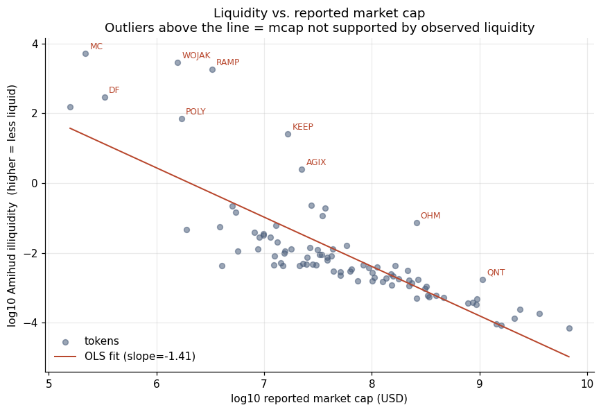
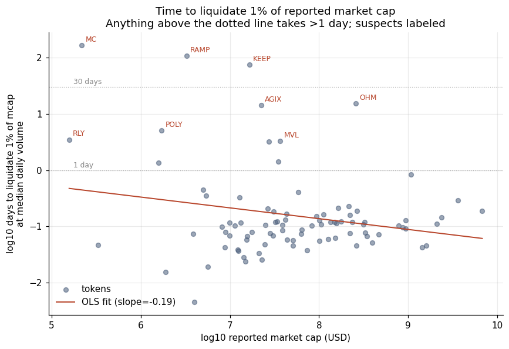
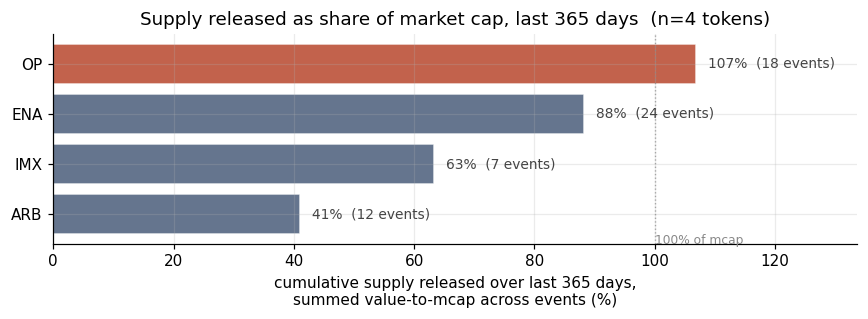

# Measurement Quality of Reported Crypto Market Capitalization (Prototype)

A pilot codebase that constructs liquidity-quality diagnostics for a panel of 90 ERC-20 tokens and benchmarks the results against CRSP common stocks. Accompanies a research proposal on supply-side (free-float) and price-side (liquidity and wash-trading) adjustments to reported crypto market capitalization, tested against scheduled token unlock events on Ethereum. An EF PhD Fellowship proposal based on this pilot was submitted in April 2026.

**Author:** Tanawat Ponggittila (PhD student, George Mason University)  
**Status:** Pilot, April 2026

## Research context

Reported crypto market capitalization is computed as *price × circulating supply*. Both terms can be noisy:

- **Supply-side.** Industry free-float methods (e.g. Coin Metrics' Adjusted Free Float Supply) deduct disclosed locked, treasury, and insider categories and round the result to the nearest 10% bucket. Tokens with concentrated but unlabeled holdings, or with large near-term scheduled unlocks, may still carry overstated effective float. A useful correction would read standard vesting contracts (Sablier, Hedgey, OpenZeppelin TokenVesting) directly on-chain and add a dormancy rule for concentrated wallets that have not transacted recently, regardless of whether they carry a public label.
- **Price-side.** No standard measure adjusts the price term for thin liquidity or wash-trading-inflated volume. Last-trade prices for thinly traded tokens may not reflect what would clear at size. A useful correction would re-weight the price term by a measure of trade quality — for example, by computing the Amihud denominator from volume on credibly surveilled (Tier-1) exchanges only, or by penalizing prices set on venues whose volume profile is inconsistent with that of trusted venues for the same token.

This repository produces descriptive liquidity diagnostics that identify the cross-section where a price-side adjustment is most likely to bind, and pulls the supply-side data the full project will use. The full project builds the actual adjustments (a stricter free-float measure on the supply side, a Tier-1-venue-filtered Amihud on the price side) and applies them jointly to scheduled token unlocks on Ethereum using the IPO lockup-expiration event-study methodology (Ofek & Richardson 2000; Field & Hanka 2001).

## Findings — liquidity diagnostics

The pilot pulls 100 ERC-20 tokens from CoinGecko; 92 return usable history and 90 remain after dropping tokens with reported market cap below $100k or missing measures. All measures are 90-day rolling windows.

**Finding 1 — A subset of tokens has illiquidity well above the size-trend prediction.** A log-log regression of Amihud (2002) illiquidity on reported market cap gives a slope of -1.41 (SE 0.12, R² 0.62) across the panel. For comparison, the analogous regression on CRSP common stocks (NYSE / NYSE-MKT / Nasdaq) over a 90-day window restricted to the same $1M–$10B market cap range yields a slope of -1.20 (SE 0.009, N=3,160; own computation from CRSP). The two slopes are not statistically distinguishable. The labeled outliers above the trend are MC, WOJAK, RAMP, DF, POLY, KEEP, AGIX, OHM, and QNT.



**Finding 2 — A long tail of tokens cannot be liquidated at meaningful size in any reasonable time frame.** Defining *days to liquidate 1% of reported market cap at median daily volume* as a units-friendly proxy for depth-to-size mismatch, the median across the panel is about 0.1 days (≈ 2.4 hours of trading). A small set of tokens take much longer:

| Token | Reported mcap | Days to liquidate 1% |
|---|---|---|
| MC | $0.2M | 167 |
| RAMP | $3.3M | 108 |
| KEEP | $16.6M | 74 |
| POLY | $11.1M | 33 |
| OHM | $252.7M | 14.9 |
| AGIX | $22.0M | 14.1 |

OHM is the largest example. At over $250M reported mcap, 1% would take about 15 trading days to clear at typical volume.



**Finding 3 — Cross-validation across measures.** The set of tokens flagged by Amihud illiquidity (Finding 1) and the set flagged by days-to-liquidate (Finding 2) overlap. Since these are different measures (return impact vs. depth-time ratio), the overlap suggests the pattern is not specific to one liquidity proxy.

These descriptive results identify the cross-section where a price-side adjustment is most likely to bind. The natural next step, deferred to the full project, is to operationalize the adjustment by computing Amihud and related measures from volume on Tier-1 exchanges only — drawing on indirect wash-trading detection methods validated in Aloosh & Li (2024) and the cross-exchange detectors in Cong, Li, Tang & Yang (2023) — and reporting the resulting liquidity-adjusted market capitalization for each token.

## Supply-side data

A separate notebook (`notebooks/02_tokenomist_supply_check.ipynb`) pulls supply-side data from the tokenomist API: token list, per-token supply breakdown, scheduled unlock events, and a cumulative-dilution measure that sums per-event `valueToMarketCap` over a lookback window. The intersection with the CoinGecko universe is small in this run — only four ERC-20 tokens have coverage in both — so cumulative dilution can only be reported for those four. Summing per-event `valueToMarketCap` over the past 365 days yields cumulative dilution of 102% (OP), 84% (ENA), 62% (IMX), and 41% (ARB). Each of these tokens released supply at least 41% of headline market cap over the year. The four-token sample is too small to support cross-sectional claims; the full project widens the intersection by going through tokenomist directly rather than starting from the CoinGecko universe.



## Limitations

- Descriptive findings on a small panel. No causal claims and no predictive tests. The full project addresses both with a larger panel and the measurement adjustments described in the accompanying proposal.
- The price-side `days-to-liquidate` measure assumes execution at *median* daily volume. Real execution at size would face additional impact and is not modeled here.
- The 90-day rolling window is a deliberate pilot choice. The full project uses a longer panel and tests robustness across alternative window lengths.

## What the prototype does

1. Pulls daily OHLCV and reported market cap for an ERC-20 universe from CoinGecko.
2. For each token, over a 90-day window:
   - Amihud illiquidity: mean of `|daily_return| / daily_dollar_volume`.
   - Days-to-liquidate-1%: `0.01 × reported_mcap / median_daily_volume`.
   - Realized volatility and max drawdown.
3. Outputs `fig1_amihud_vs_mcap.png` and `fig2_days_to_liquidate_by_decile.png`.
4. (Notebook 2) Pulls tokenomist supply data and unlock events; produces supplementary supply-side figures.

## Quickstart

```bash
# Python 3.9+
pip install -r requirements.txt

# Create a .env file with API keys (see .env.example).
jupyter lab notebooks/01_pilot_walkthrough.ipynb
```

The CoinGecko pull takes about 4 minutes on the first run and is cached for 24 hours.

## Data and licensing

CoinGecko data is pulled from the public API. Tokenomist data is a paid subscription; per their terms it is for personal, non-commercial, non-redistribution use only. Cache directories are gitignored.
